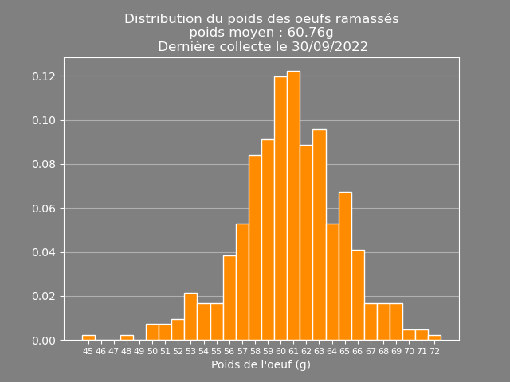
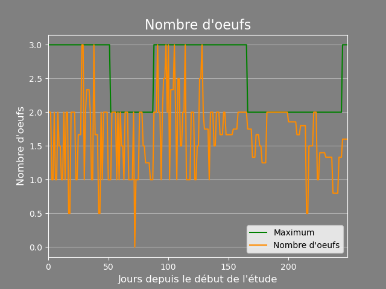
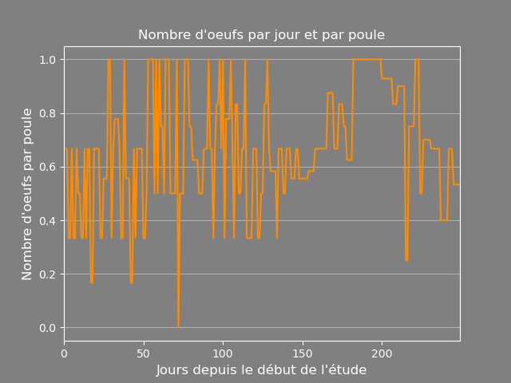
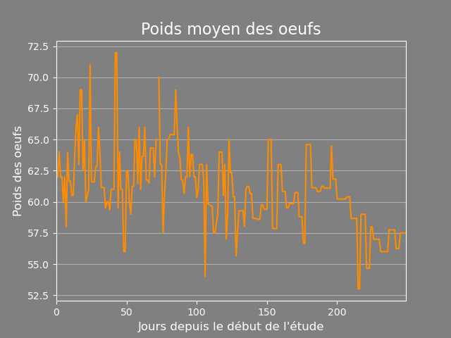
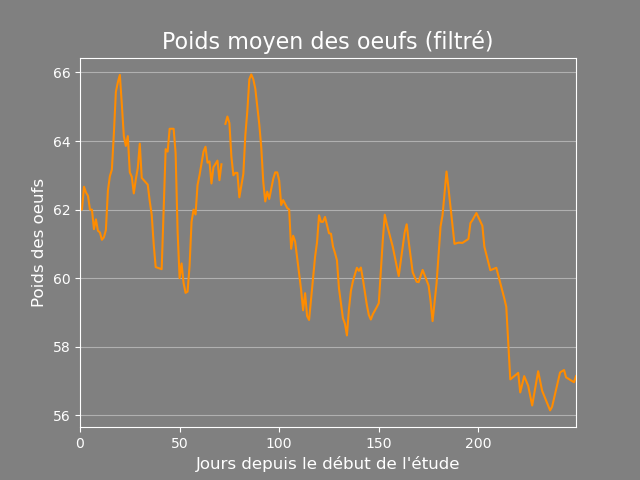

# :chicken: data poules :chicken:

## Objectif du dépôt

Un dépôt pour l'analyse de la ponte de mes poules à travers les saisons.

## Contexte de l'étude et données analysées
Deux ou trois poules relativement agées (plus d'un an). Dans un espace d'environ 20 mètres carré, régulièrement laissées libres sur mon terrain.

Chaque fois que je ramasse les oeufs de mes 3 poules, je le consigne dans le tableau CSV. Des scripts python sont utilisés pour tracer les courbes et analyser.
 
On compte les oeufs ramassés régulièrement, pour qu'un oeuf soit comptabilisé, il faut qu'il ne se soit pas cassé avant la pesée.
 
## Langage
Les scripts sont en Python.

## License
License MIT

## Résultats
Les résultats ci-dessous sont obtenus grâce aux scripts réalisés.

